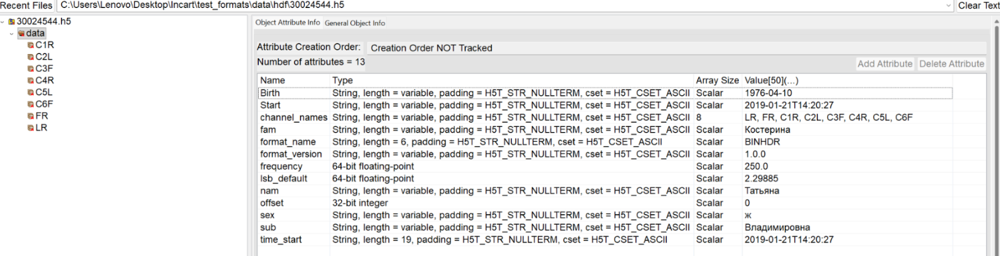
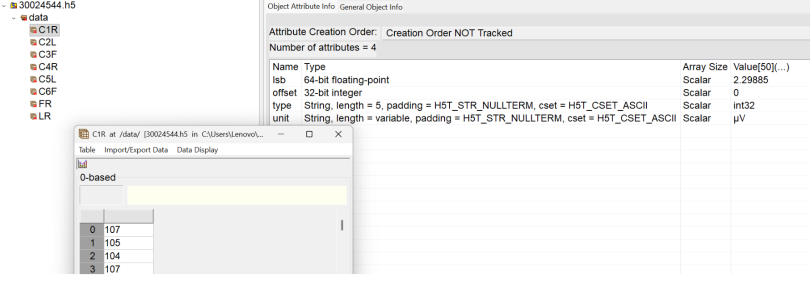
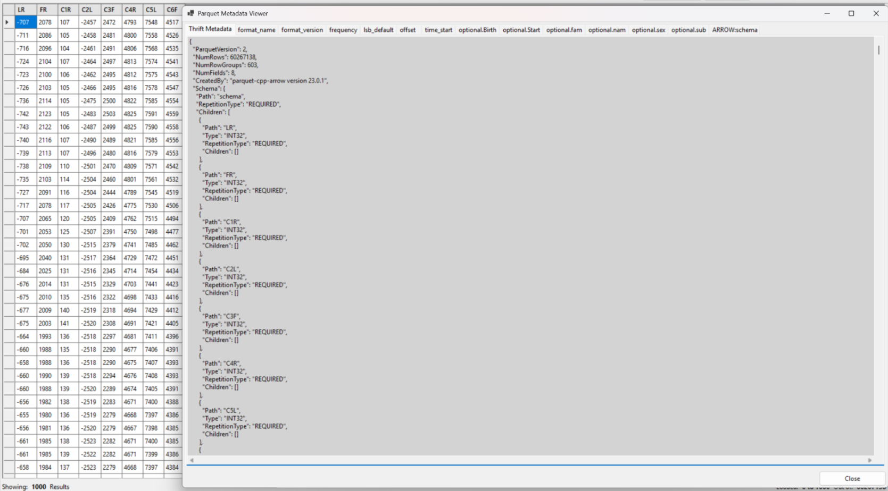
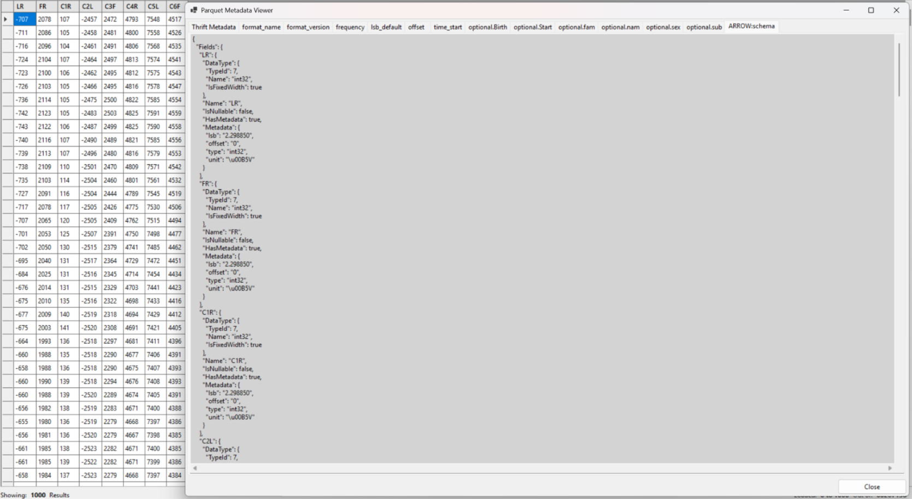
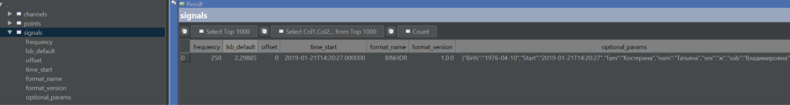
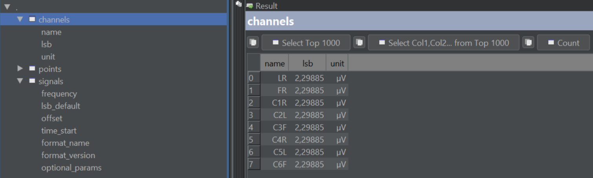
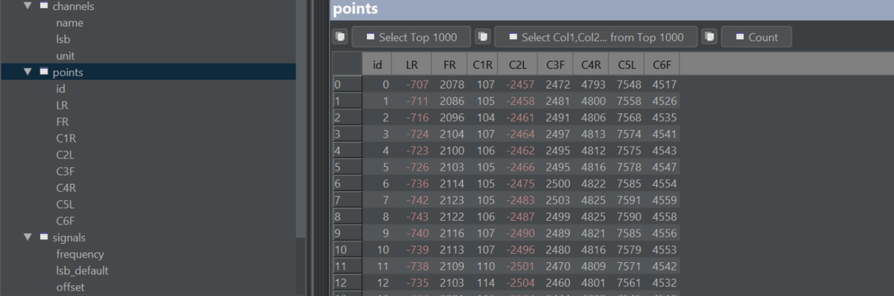

# Кроссплатформенная библиотека, которая работает с .bin/.hdr - конвертирует их в hdf5, parquet, duckdb.

Кроссплатформенная C++20 библиотека для чтения сигналов из парных файлов .hdr/.bin и конвертации данных в DuckDB, HDF5 и Parquet. Для стабильного ABI используется C API для интеграции с другими языками.

## Возможности

- Чтение метаданных из .hdr и данных из .bin.
- Потоковое чтение больших файлов порциями.
- Конвертация в DuckDB/HDF5/Parquet.
- C API для использования из C/других языков.

## Сборка

### Требования

- CMake 3.21+
- Компилятор с поддержкой C++20
- vcpkg (manifest mode)
- Зависимости: DuckDB, Arrow/Parquet, HDF5 (cpp), OpenSSL

### Сборка с пресетами (vcpkg)

```bash
cmake --preset vcpkg
cmake --build --preset vcpkg
```

### Сборка без пресетов

```bash
cmake -S . -B build \
   -DCMAKE_BUILD_TYPE=Release \
   -DCMAKE_TOOLCHAIN_FILE="$VCPKG_ROOT/scripts/buildsystems/vcpkg.cmake"
cmake --build build
```

### Доступные функции

- DuckDB: `signals_duckdb_read`, `signals_duckdb_write`, `signals_duckdb_write_with_params`
- HDF5: `signals_hdf5_read`, `signals_hdf5_write`
- Parquet: `signals_parquet_read`, `signals_parquet_write`

### Тесты и утилиты

Внутренние тесты и раннеры включаются опцией `SIGNALS_BUILD_INTERNAL` (включена по умолчанию). Часть тестов требует указания файла .hdr на этапе конфигурации (все тесты, которые лежат вне self_tests).

## Описание формата, который описан во всех используемых форматах (duckdb, hdf5, parquet), находится ниже:
<details><summary><strong>HDF5</strong></summary>

**HDF5 (Hierarchical Data Format)** - формат данных, поддерживающий два основных типа объектов: наборы данных (datasets) и группы (groups). Формат организует данные в древовидную структуру, аналогичную файловой системе, где доступ к данным осуществляется по пути (группа/подгруппа/данные).<br>
С терминами, относящимися к hdf5, можно ознакомиться на сайте: [HDF5 Reference Manual](https://support.hdfgroup.org/documentation/hdf5/latest/_r_m.html).<br>
Расшифровка полей метаданных: [ИНКАРТ: протоколы обследований](https://docs.google.com/document/d/1zNhH1G7cSUZKwtpmB3L-peq0QUt5fds9bInCMtltpL0/edit?tab=t.0).

### Терминология
- **Группа /data** - корневая группа данных формата. В ней содержатся обязательные и опциональные атрибуты группы, датасеты с сырыми данными каждого канала, формат и версия схемы. Данная группа введена для того, чтобы иметь возможность сохранять дополнительные части данных (дневник, разметку и т.д.) в отдельных группах, с собственным названием формата и версией схемы.
- **Название формата** - значение атрибута format_name группы /data. Описывает способ хранения конкретного набора данных в группе /data. Для текущих данных, полученных из bin+hdr, используется значение “BINHDR”.
- **Схема данных** - описание структуры группы /data, перечень обязательных и опциональных атрибутов группы, а также атрибутов каждого сигнала.
- **Версия схемы** - значение атрибута format_version группы /data. Описывает версию способа хранения данных, записывается в формате major.minor.patch (например, в версии 1.0.0 атрибут endTime - опционален, а в 1.1.0 - может быть обязательным).
- **Атрибут** - поле описания группы /data или отдельного сигнала.

*Список обязательных атрибутов группы /data:*
| Название атрибута | Тип | Описание |
|-------------------|-----|-----------|
| `format_name` | `string` | имя формата данных, описывает способ хранения конкретных данных (для bin + hdr - ”BINHDR”) |
| `format_version` | `string` | версия формата, описывает версию способа хранения данных (например, в версии 1.0.0 атрибут endTime - опционален, а в 1.1.0 - может быть обязательным) |
| `frequency` | `float64` | частота дискретизации сигналов (Гц) |
| `lsb_default` | `float64` | значение младшего бита по умолчанию для каналов, у которых не задано индивидуальное значение lsb |
| `offset` | `int32` | смещение (начало отсчета) |
| `time_start` | `string` | дата и время начала измерений в виде строки формата “yyyy-mm-ddThh:mm:ss” |
| `channel_names` | Одномерный массив строк (`string[N]`) | наименование каналов, указывает порядок следования каналов, который соответствует исходному файлу (hdr) |

- **Опциональные атрибуты** - дополнительные атрибуты, сформированные путем парсинга данных из заголовочного файла (hdr) и записываемые в группу /data. Исходная запись вида type:name:value не сохраняется как единая строка, а сохраняется только name и value (название атрибута и его значение) как остальные атрибуты группы.
- **Типы опциональных атрибутов** - типы значений, которые определяются для опциональных параметров группы /data. Определение типа данных опирается на спецификатор type исходного файла: при значениях l (int64) и s (string) выполняется типизация, в остальных случаях данные сохраняются в строковом формате.
  
- **Сигнал** - одномерный датасет внутри группы /data. Один датасет соответствует одному каналу исходной записи. Имя датасета совпадает с названием канала из массива channel_names. Порядок каналов определяется только массивом channel_names. Данные в датасете представлены одномерным массивом целых чисел (int32), где содержатся сырые значения сигнала после АЦП.
- **Сырые значения сигнала** - значения (int32), записанные в датасет без расчета физической величины. Для получения физического значения точки вычисляется как значение из датасета умноженное на lsb (значение младшего бита, берется из атрибута данного датасета).

*Список атрибутов у всех датасетов одинаковый:*

</details>

<details><summary><strong>Parquet</strong></summary>

**Apache Parquet** - колоночный формат-файл для хранения табличных данных. Поддерживает блочную запись, эффективное сжатие, колоночное хранение и встроенные метаданные. Позволяет работать с множеством файлов через простое объединение или партицирование по значениям полей.<br>
С терминами, относящимися к parquet, можно ознакомиться на сайте: [Arrow Columnar Format — Apache Arrow v24.0.0](https://arrow.apache.org/docs/dev/format/Columnar.html).<br>
Расшифровка полей метаданных: [ИНКАРТ: протоколы обследований](https://docs.google.com/document/d/1zNhH1G7cSUZKwtpmB3L-peq0QUt5fds9bInCMtltpL0/edit?tab=t.0).

### Терминология
- **Parquet-файл** - файл данных формата Parquet. В нем содержится одна таблица сигналов, где каждая колонка соответствует одному каналу исходной записи, а каждая строка соответствует одной точке сигнала.
- **Таблица сигналов** - основная таблица файла. Количество колонок таблицы равно количеству каналов, количество строк равно количеству сохраненных отсчетов сигнала. Одна строка содержит сырые значения всех каналов в один момент времени.
- **Схема данных** - описание структуры Parquet-файла: перечень колонок сигналов, тип данных колонок, файловые метаданные и метаданные каждой колонки. Схема определяет, какие каналы есть в файле и в каком порядке они расположены.
- **Название формата** - значение ключа файловых метаданных format_name, описывает способ хранения конкретного набора данных в файле. Для текущих данных, полученных из bin+hdr, используется значение “BINHDR”.
- **Версия схемы** - значение ключа файловых метаданных format_version. Описывает версию способа хранения данных, записывается в формате major.minor.patch (например, в версии 1.0.0 параметр endTime - опционален, а в 1.1.0 - может быть обязательным).
- **Файловые метаданные** - атрибуты в формате пары ключ:значение, относящиеся ко всему Parquet-файлу. В них сохраняются общие параметры записи, название формата, версия схемы и опциональные параметры из hdr. Все значения файловых метаданных сохраняются в строковом виде.

*Список обязательных файловых метаданных:*
| Название атрибута | Описание |
|-------------------|-----------|
| `format_name` | имя формата данных, описывает способ хранения конкретных данных (для bin + hdr - ”BINHDR”) |
| `format_version` | версия формата, описывает версию способа хранения данных в формате major.minor.patch |
| `frequency` | частота дискретизации сигналов (Гц) |
| `lsb_default` | значение младшего бита по умолчанию для каналов, у которых не задано индивидуальное значение lsb |
| `offset` | смещение (начало отсчета) |
| `time_start` | дата и время начала измерений в виде строки формата “yyyy-mm-ddThh:mm:ss” |

- **Опциональные файловые метаданные** - дополнительные пары ключ:значение, сформированные путем парсинга данных из заголовочного файла hdr и записываемые в файловые метаданные. Исходная запись вида type:name:value не сохраняется как единая строка, а сохраняется ключ optional.(name) и значение value. Все значения опциональных файловых метаданных сохраняются в строковом виде.
  
- **Колонка сигнала** - колонка таблицы, соответствующая одному каналу исходной записи. Имя колонки совпадает с названием канала. Данные в колонке представлены последовательностью целых чисел (int32), где содержатся сырые значения сигнала после АЦП.
- **Сырые значения сигнала** - значения (int32), записанные в колонку без расчета физической величины. Для получения физического значения точки вычисляется как значение из колонки умноженное на lsb (значение младшего бита, берется из метаданных данной колонки).
- **Метаданные колонки сигнала (field metadata)** - атрибуты в формате пары ключ:значение, относящиеся к отдельной колонке сигнала, т.е. они описывают параметры конкретного сигнала.
- **Строковая группа (row group)** - блок строк. Данные записываются и читаются блоками, чтобы можно было обрабатывать большие записи частями и читать нужные диапазоны без загрузки всего файла.

*Список метаданных у всех колонок сигнала одинаковый:*
| Название атрибута | Описание |
|-------------------|-----------|
| `lsb` | значение младшего бита для данного канала. |
| `offset` | смещение. |
| `type` | тип сырых значений колонки. Для данной схемы - int32. |
| `unit` | единица измерения физического значения сигнала. |


</details>

<details><summary><strong>DuckDB</strong></summary>

**Duckdb** - встраиваемая колоночная СУБД. У которой довольно медленные транзакции insert и update, однако при использовании appender-а данный недостаток нивелируется.<br>
С терминами, относящимися к duckdb, можно ознакомиться на сайте: [DuckDB](https://duckdb.org/docs/current/clients/c/overview).<br>
Расшифровка полей метаданных: [ИНКАРТ: протоколы обследований](https://docs.google.com/document/d/1zNhH1G7cSUZKwtpmB3L-peq0QUt5fds9bInCMtltpL0/edit?tab=t.0).

### Терминология
- **DuckDB-файл** - файл базы данных DuckDB, который содержит одну исходную запись (bin + hdr). Файл включает три таблицы: signals, channels и points.
- **Схема данных** - описание структуры DuckDB-файла: таблицы signals, channels, points и связи между ними.
- **Таблица signals** - таблица общих метаданных записи (содержит одну строку).

*Поля таблицы signals:*
| Название поля | Тип | Описание |
|---------------|-----|-----------|
| `frequency` | `double` | частота дискретизации сигналов (Гц) |
| `lsb_default` | `double` | значение младшего бита по умолчанию для каналов, у которых не задано индивидуальное значение lsb |
| `offset` | `bigint` | смещение (начало отсчета) |
| `time_start` | `timestamp` | дата и время начала измерений в виде строки формата “yyyy-mm-ddThh:mm:ss” |
| `format_name` | `varchar` | имя формата данных, описывает способ хранения конкретных данных (для bin + hdr - ”BINHDR”) |
| `format_version` | `varchar` | версия формата, описывает версию способа хранения данных в формате major.minor.patch |
| `optional_params` | `JSON` | Опциональные параметры |
*Прим.: offset в кавычках, потому что offset зарезервировано в sql.*



- **Опциональные параметры** - дополнительные параметры, сформированные путем парсинга данных из заголовочного файла hdr. В DuckDB они сохраняются в поле optional_params таблицы signals в формате JSON.
- **Таблица channels** - таблица метаданных каждого канала (по 1 строке на канал). Порядок строк определяет порядок колонок в таблице points.

*Поля таблицы channels:*
| Название поля | Тип | Описание |
|---------------|-----|-----------|
| `name` | `varchar` | название канала |
| `lsb` | `double` | значение младшего бита для данного канала. |
| `unit` | `varchar` | единица измерения физического значения сигнала. |



- **Таблица points** - таблица сырых значений сигналов. Имена и порядок каналов берутся из таблицы channel_names. Таблица содержит id записи и количество колонок равно количеству каналов.
- **Сырые значения сигнала** - значения (int32), записанные в колонку без расчета физической величины. Для получения физического значения точки вычисляется как значение из колонки умноженное на lsb (значение младшего бита, берется из метаданных данной колонки).
- **Колонка сигнала** - колонка таблицы, соответствующая одному каналу исходной записи. Имя колонки совпадает с названием канала. Данные в колонке представлены последовательностью целых чисел (int32), где содержатся сырые значения сигнала после АЦП.


</details>
